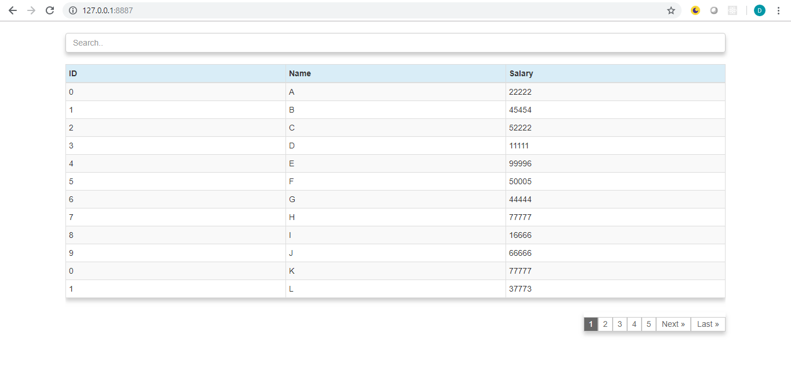

## Pagination Component
pagination component is used to separate long sets of data so that it is easier for a user to consume information. this component is developed by using Jquery and bootstrap.this component performs filtering asa well as shorting.
#### Output format in Desktop view

#### Output format in Mobile view

