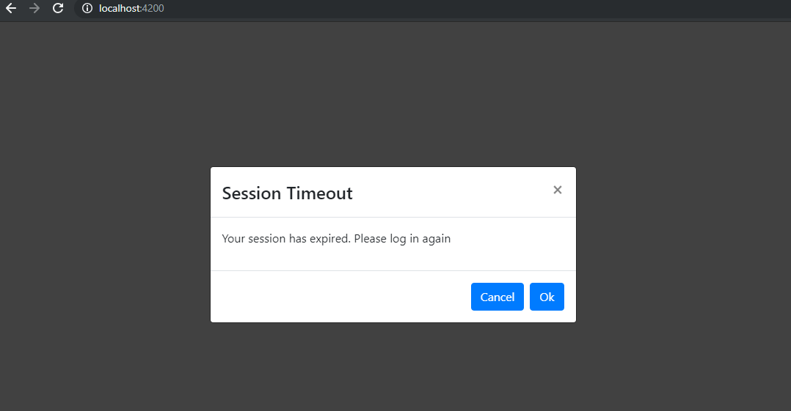
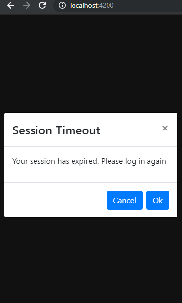

# Time Out Component

Time Out Component is a web component developed using angular 7 and bootstrap which is used for monitor the ideal time of user in website.
if user do not perform any action on a web site during a interval then one modal will display session is expired and guide the user further.

## Output Format for Desktop view
<p align='center'></p>

## Output Format for Mobile view
<p align='center'></p>  


To preview demo of Time Out Component [click here](https://stackblitz.com/edit/angular-dxtdq3-7abbtt?file=index.html)


## Getting Started
We can either use only the Time Out Component as a re-usable component or Custom HTML Tag.

Download the timeout.component to your angular project and include required packages and run the application.

```
<timeout-notification duration="10" timeoutmessage="Your session has expired. Please log in again"  successurl="http://www.google.com" cancelurl="http://www.google.com"></timeout-notification>

```

duration,timeoutmessage,successurl and cancelurl inputs properties are passed to the 
Time Out Component.

### Installing
Following packages need to install in project
```
npm install
```
## Build

Run `ng build` to build the project. The build artifacts will be stored in the `dist/` directory. Use the `--prod` flag for a production build.

## Development server

Run `ng serve` for a dev server. Navigate to `http://localhost:4200/`. The app will automatically reload if you change any of the source files.

## Running unit tests

Run `ng test` to execute the unit tests via [Karma](https://karma-runner.github.io).

## Running end-to-end tests

Run `ng e2e` to execute the end-to-end tests via [Protractor](http://www.protractortest.org/).

## Adding Time Out Component as HTML Custom Tag

* Need to added the bundled main js(check inside dist folder) files and supported polyfills. Please check the references as `index.html` file in `dist folder`.

* Use same as below custom tag in html file
```
<timeout-notification duration="10" timeoutmessage="Your session has expired. Please log in again"  successurl="http://www.google.com" cancelurl="http://www.google.com"></timeout-notification>
```

## Properties we need to pass into the Time Out Component

### Duration

User will provide the ideal time interval and  if user do not perform any action on a 
website during a that interval session out modal will display on screen.

### TimeoutMessage

User will provide  message to user display on screeen when session timeout happened.

### successurl and cancelurl

User will provide urls to navaigate appropriate pages based on operation.

## References
* [Angular Elements](https://angular.io/guide/elements)
* [Angular Elements Blog Reference](http://fiyazhasan.me/creating-reusable-custom-elements-in-angular-6-2/)


